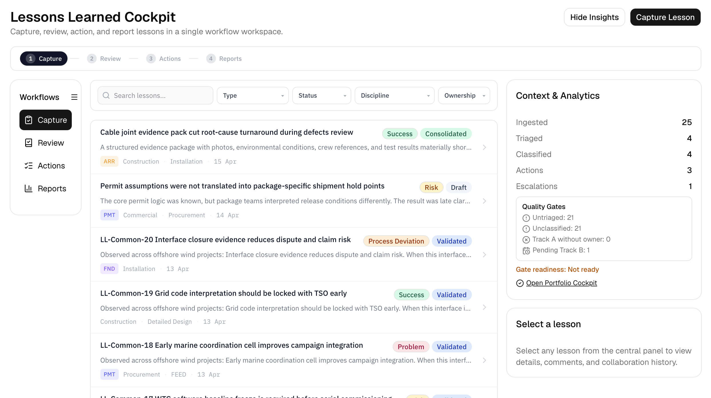
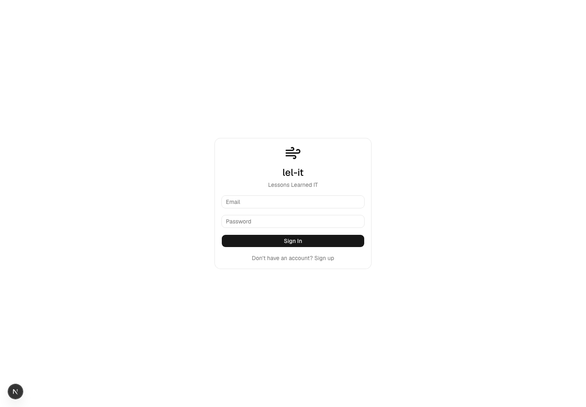
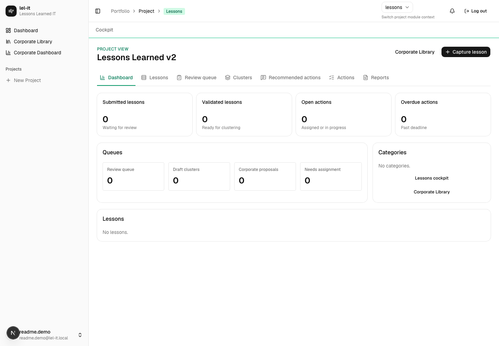
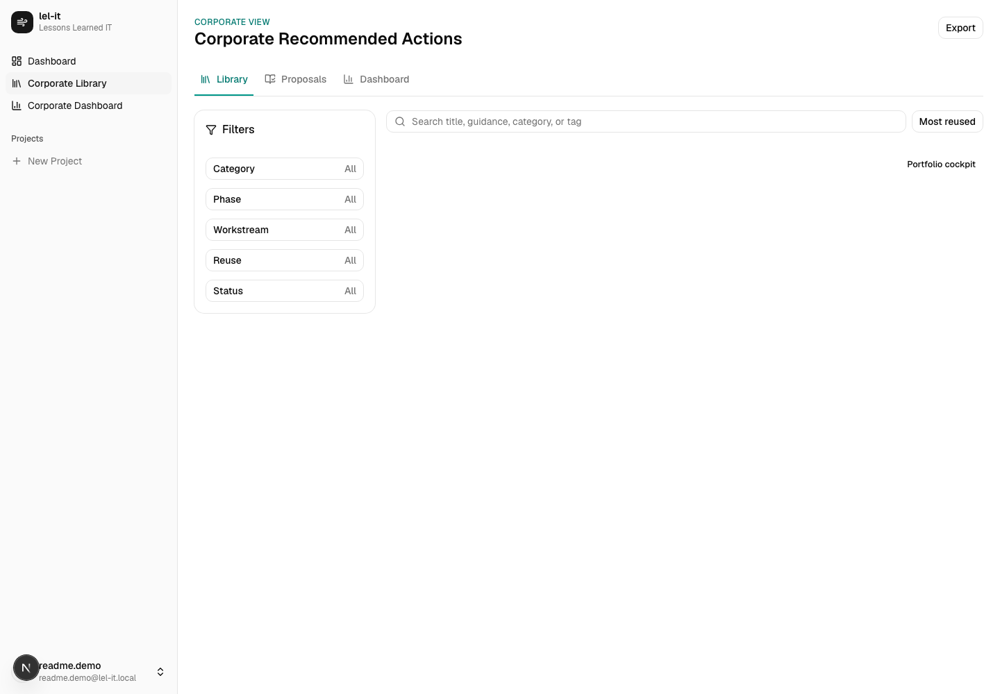
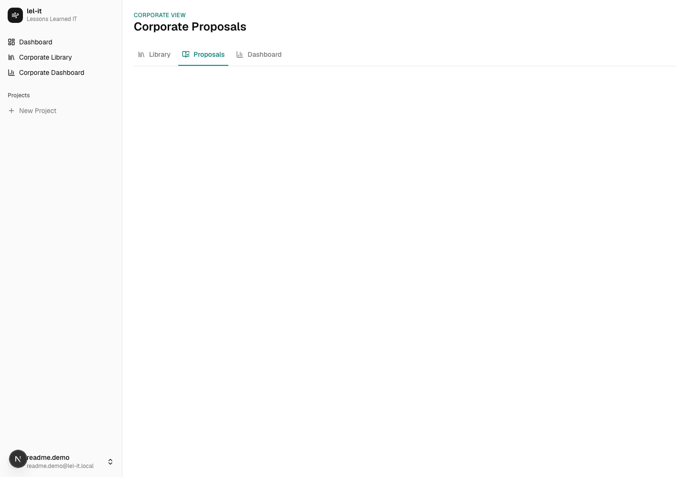
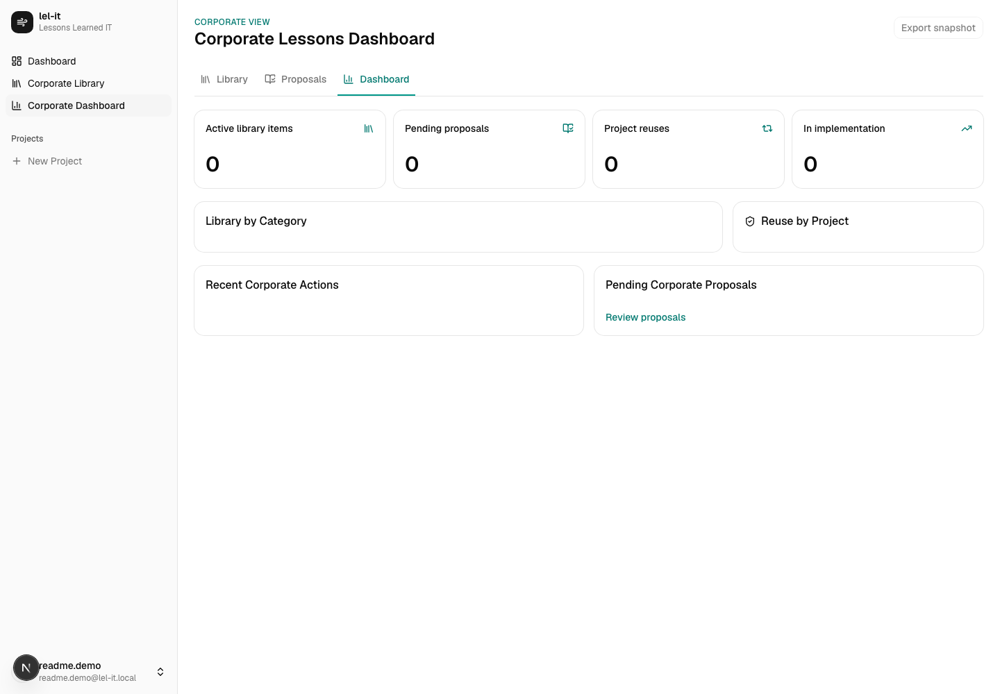

# lel-it - Lessons Learned IT

lel-it is a Lessons Learned IT product for offshore wind delivery teams. It supports the full lessons lifecycle: project capture, review, validation, clustering, project action creation, corporate transfer, corporate library reuse, and implementation tracking.

The application is currently focused on the Lessons v2 workflow and the corporate governance layer around it.



## Product Scope

lel-it is designed for project organizations that need lessons learned to become operational controls, not archive records. The tool keeps project teams close to the day-to-day evidence while giving senior management and Lessons Learned management a corporate view of reusable recommendations.

The current implementation covers:

- Project Lessons v2 cockpit for lesson capture, review queues, clustering, recommended actions, project actions, and reporting.
- Corporate recommended actions library for approved reusable guidance.
- Corporate proposal review for promoting project recommendations into corporate guidance.
- Corporate dashboard for library coverage, proposal backlog, reuse, and implementation visibility.
- Role-aware access so all users can browse corporate guidance while source-project visibility remains limited to senior management and Lessons Learned management.
- Demo seed data with 47 project lessons, recommended actions, corporate proposals, corporate library entries, and implementation actions.

## Screenshots

### Login

The product is branded as `lel-it` / Lessons Learned IT in the shell, metadata, and login screen.



### Project Lessons Cockpit

The project cockpit is the operational entry point for a project team. It shows submitted and validated lessons, review queues, clusters, corporate proposals, project actions, and reports from one project-scoped surface.



### Corporate Library

The corporate library contains approved reusable recommended actions. Corporate viewers can browse guidance, and eligible project users can add a corporate action into a project implementation plan.



### Corporate Proposal Review

Corporate Lessons Learned managers review project recommendations proposed for corporate reuse and publish approved items into the corporate library.



### Corporate Dashboard

The corporate dashboard gives senior stakeholders a roll-up of active library items, pending proposals, project reuse, implementation count, category coverage, and recent corporate actions.



## Core Workflows

### Project Workflow

1. Capture a lesson as a draft or submit it immediately.
2. Review submitted lessons and validate the ones worth acting on.
3. Cluster validated lessons into recurring themes.
4. Create recommended actions from validated lessons or approved clusters.
5. Approve project actions and optionally propose reusable recommendations for corporate review.
6. Add approved corporate recommended actions back into projects as implementation actions.
7. Track ownership, deadline, evidence, verification, and closure.

### Corporate Workflow

1. Browse approved reusable guidance in the corporate library.
2. Review project recommendations proposed for corporate reuse.
3. Publish approved recommendations into the corporate library.
4. Monitor corporate reuse and implementation from the corporate dashboard.
5. Keep source project names visible only to senior management and Lessons Learned management.

## Access Model

Project access derives from existing project membership and optional Lessons v2 project membership.

Project-facing roles:

- `ll_lead`: full project Lessons v2 capability, including validation, clustering, recommended actions, corporate transfer, assignment, verification, and export.
- `reviewer`: review, validate, cluster, create recommended actions, and update owned implementation actions.
- `contributor`: capture lessons and update owned implementation actions.
- `viewer`: browse project lessons; export is allowed only when `can_export` is enabled.

Corporate roles:

- `corporate_viewer`: browse the corporate library.
- `corporate_ll_manager`: review and publish corporate proposals, edit/retire corporate actions, view source project names, and use the corporate dashboard.
- `senior_management`: view corporate library, dashboard, and source project names.
- `corporate_admin`: administer platform-level reference data.

## Demo Data

Seed the newest active local project with the Lessons v2 demo dataset:

```bash
pnpm --filter @owit/db seed:lessons-v2-demo
```

The seed is idempotent by title/source checks. It creates:

- 47 project lessons across engineering, procurement, construction, installation, commissioning, HSE, commercial, quality, and project management.
- Project workstreams and gate references.
- Approved clusters for recurring themes.
- Project recommended actions.
- Corporate proposals and published corporate recommended actions.
- Project implementation actions and assignments.
- A corporate Lessons Learned manager role for the local development user.

The seed targets the newest active project in the local database. Create or activate the intended project before running it if needed.

## Tech Stack

- TypeScript, React 19, and Next.js 16.
- tRPC v11 and TanStack Query.
- Drizzle ORM with PostgreSQL / local Supabase Postgres.
- Tailwind CSS v4 and shadcn-style UI primitives.
- Vitest for focused workflow tests.
- pnpm workspaces.

## Workspace

```text
apps/web        Next.js application
packages/db     Drizzle schema, migrations, seed data
packages/shared Shared enums and shared types
docs/assets     README screenshots and process diagrams
```

## Local Setup

Install dependencies:

```bash
pnpm install
```

Start local Supabase/Postgres if it is not already running, then apply migrations:

```bash
pnpm --filter @owit/db db:migrate
```

For the local database used in this workspace, older migrations may already exist outside Drizzle's migration journal. If full replay collides with existing objects, apply only missing migration files or use `db:push` against a disposable local database.

Run the web app:

```bash
pnpm --dir apps/web dev
```

Open:

- Project lessons: `/projects/<project-id>/lessons`
- Corporate library: `/corporate/library`
- Corporate proposals: `/corporate/proposals`
- Corporate dashboard: `/corporate/dashboard`

## Email-to-Lesson Inbox

Forward or CC an email to a lel-it inbound address to capture it as a draft lesson candidate.

**How it works:**

- A registered user forwards or CCs an email to a Postmark inbound address.
- If the email's `From` address matches a registered user's account email, the email is captured into that user's personal Inbox (`/inbox`), including any attachments.
- From the Inbox, the user assigns the item to a project and category to turn it into a draft lesson (attachments carry over).
- Emails from unrecognized senders are dropped (not stored).

**Env vars:**

- `INBOUND_EMAIL_SECRET` - shared secret embedded in the webhook URL path.
- Also relies on existing `NEXT_PUBLIC_SUPABASE_URL` and `SUPABASE_SERVICE_ROLE_KEY` (attachment storage) and `DATABASE_URL`.

**Webhook URL:**

```text
https://<host>/api/inbound/email/<INBOUND_EMAIL_SECRET>   (POST)
```

- A mismatched secret returns `401`.
- Unknown-sender, duplicate, or malformed payloads return `200` (so Postmark does not retry).

**Postmark inbound setup:**

1. Point your Postmark inbound server's webhook at the URL above.
2. Set the inbound domain's MX records to Postmark, per [Postmark's inbound domain forwarding docs](https://postmarkapp.com/support/article/1064-inbound-domain-forwarding).
3. Postmark posts parsed JSON (`From`, `Subject`, `TextBody`, `Attachments`, ...). Deduplication is by the Postmark `MessageID`.

**Roadmap:** Slack and Teams bots will offer the same "tag -> capture" flow in future.

**Local testing:**

With `INBOUND_EMAIL_SECRET=devsecret` set:

```bash
curl -X POST http://localhost:3000/api/inbound/email/devsecret \
  -H 'Content-Type: application/json' \
  -d '{"FromFull":{"Email":"<your-auth-user-email>","Name":"Dev"},"MessageID":"smoke-1","Subject":"Smoke test lesson","TextBody":"Body line one\nBody line two","Date":"2026-06-14T10:00:00Z","Attachments":[]}'
```

Expected response: `{"status":"captured", ...}`. The item then appears at `/inbox`.

## Operational Checks

Useful verification commands:

```bash
pnpm --dir apps/web type-check
pnpm --dir apps/web test src/server/__tests__/lesson-v2-workflow.test.ts src/server/__tests__/lesson-v2-rbac.test.ts src/server/__tests__/lesson-v2-transfer.test.ts
apps/web/node_modules/.bin/tsc -p packages/db/tsconfig.json --noEmit --typeRoots apps/web/node_modules/@types
apps/web/node_modules/.bin/tsc -p packages/shared/tsconfig.json --noEmit --typeRoots apps/web/node_modules/@types
```

## Notes

- Corporate library browsing is available broadly; proposal publishing and source project visibility remain role-gated.
- The local demo seed is for development and presentation data only.
